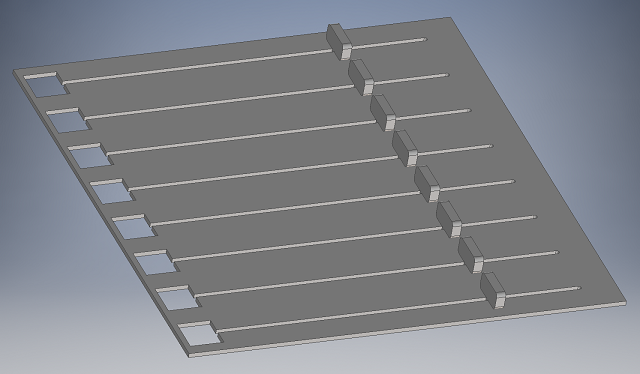
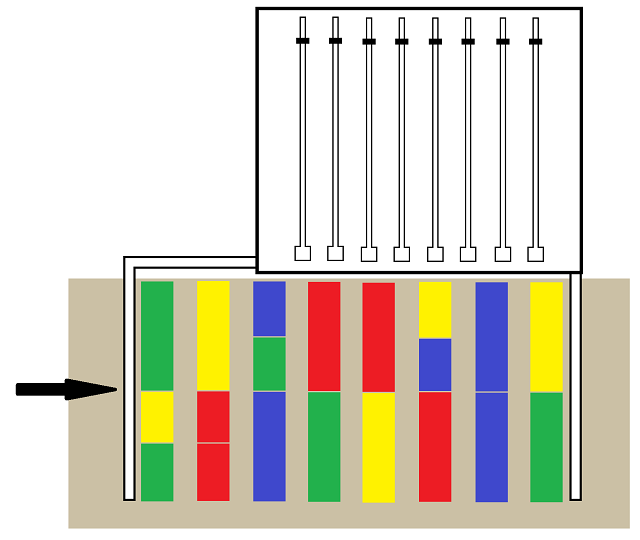
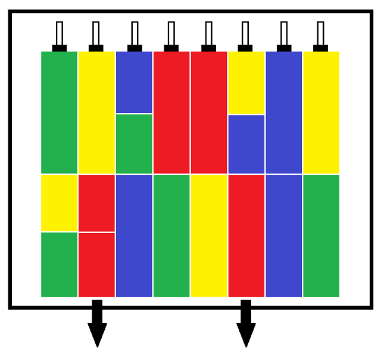

Platform
========

See also: [AVR Block Shover](https://github.com/ieeefiu/avr_block_shover).

This is a program for the ATmega328p that controls the platform that eats and shoves colored blocks for FIU's entry in the 2016 IEEE Southeastcon student hardware competition.

Description
-----------

Eats blocks, shoves them out by color. Platform looks like this:

The fwd edge of each rail has a color sensor facing upward, which reads the color of whatever is sitting on top of it.

Each rail has a pin that moves back and forth to enable block shoving. Hall effect sensors are used to calibrate the pins at their zero position at the rear of the platform.

There are three zones of blocks that the platform must eat. The eating step works the same for each zone: compress all the blocks together and move them onto the platform using extending arms.

After consumption:

The platform barfs out the blocks differently depending on which zone.

- Zone A has all blue blocks. All of these blocks get dumped onto the corkboard zone. The sensors are not necessary for this step, only the pins.

- Zone B has a mixture of colors and sizes. These blocks get sorted by color into four buckets. The way it works is as follows:
 - Move in front of a bucket and detect the color of that bucket.
 - Check the color of the forwardmost block in each rail, pop into the bucket if it matches the color. Check the next block and repeat if necessary.
 - Move to the next bucket and repeat.
 - Repeat the above three steps until there are no more blocks on the platform.
 
- Zone C contains a mixture of colors. All the blue ones go in the corkboard and all the rest go in the truck zone.

Materials
---------

- ATmega328p - Cheap 8-bit microcontroller
- TCS34725 - I2C color sensor
- PCA9547 - I2C channel switcher
- US5881 - Cheap hall effect sensor
- Some manner of motor or servo, idk

Libraries
---------

- USART library by [Elliot Williams](https://github.com/hexagon5un)
- I2C master library by [g4lvanix](https://github.com/g4lvanix)

who
---

- [Elisa Ravelo](https://github.com/elira0) - Hardware
- [Will Oberndorfer](https://github.com/mancxvi) - Software
